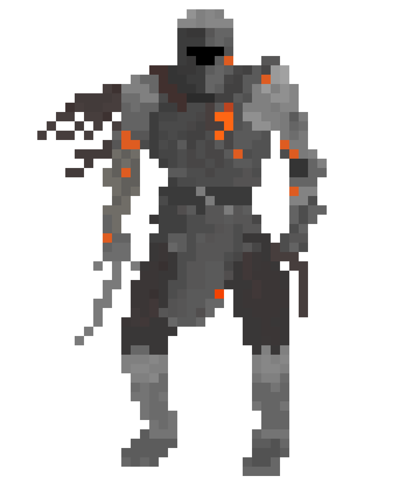

  
  

  
  

###  About Me :

I am a Frontend Developer. I was born in Novotroitsk, but currently I live in Chelyabinsk.

- :telescope: I’m working as a Frontend Developer, but sometimes can write backend with Python. I'm contributing to frontend and backend for building web applications (currently at  <a href="http://3divi.ai">3divi.ai</a>).

- :zap: In my free time, I like to play video games, read tech articles and watch tech videos.

---

### :hammer_and_wrench: Languages and Tools :

  
  
   
   
  
          
  
  
  
 

