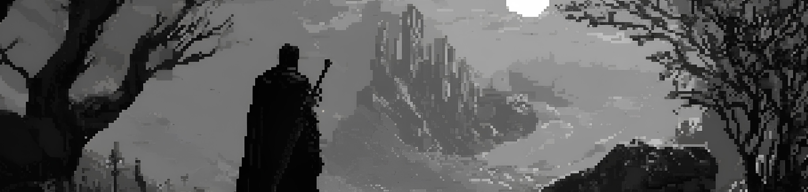

<!-- Шапка — широкая картинка -->

  

<!-- Бейджи -->

  
  
  
  

 

<!-- Вертикальное изображение справа -->

### 👋 hey, i'm kirill

frontend developer focused on clarity, structure, and stability.  
i build systems that stay readable, fixable, and kind to the next person.

mostly working with the web.  
currently [@3divi.ai](https://3divi.ai) — building developer tools and SDKs.

i write about bugs, tools, and things that go wrong — and how to make them right.  
sometimes with humor, always with intent.

---

### 🧠 how i think

- good code is quiet  
- interfaces should explain themselves  
- bugs are signals, not shame  
- backwards compatibility is a feature  
- stability is the real flex  
- growth is the only constant

---

### 📌 what i do

- design frontend architecture for change and clarity  
- share lessons from debugging and upgrades  
- explore tools that make dev work smoother  
- write for those who are figuring it out too

---

### 🛠️ tech stack

TypeScript, React, Next.js, RTK  
TailwindCSS, Chakra UI, feature-sliced design

---

### 📊 github stats

---

<i>this profile was written in light mode. probably at night.</i>
